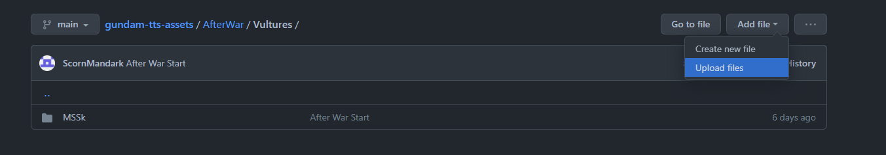
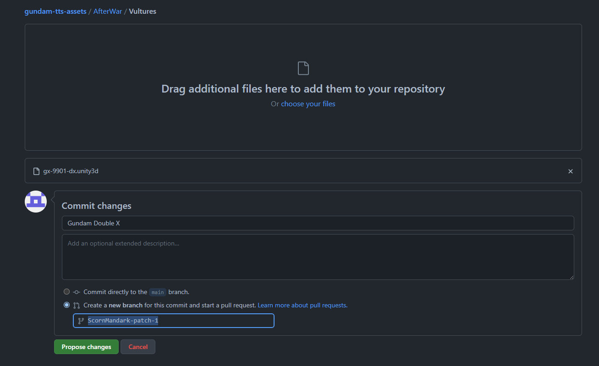
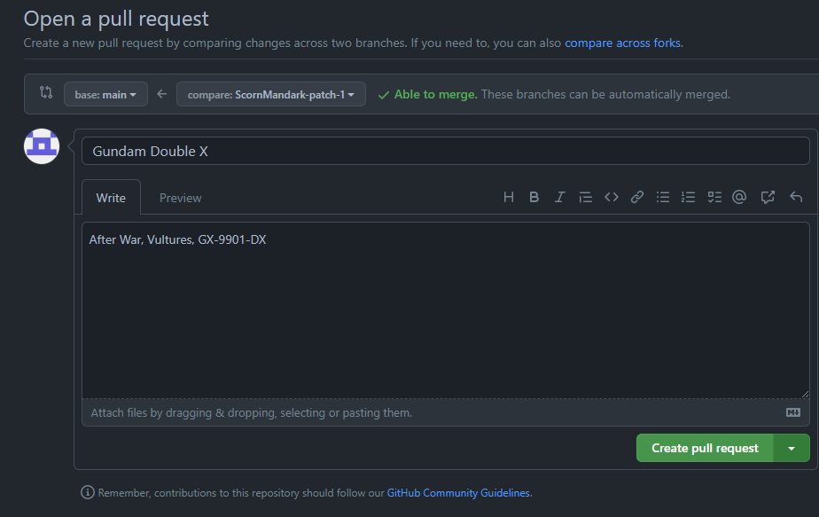
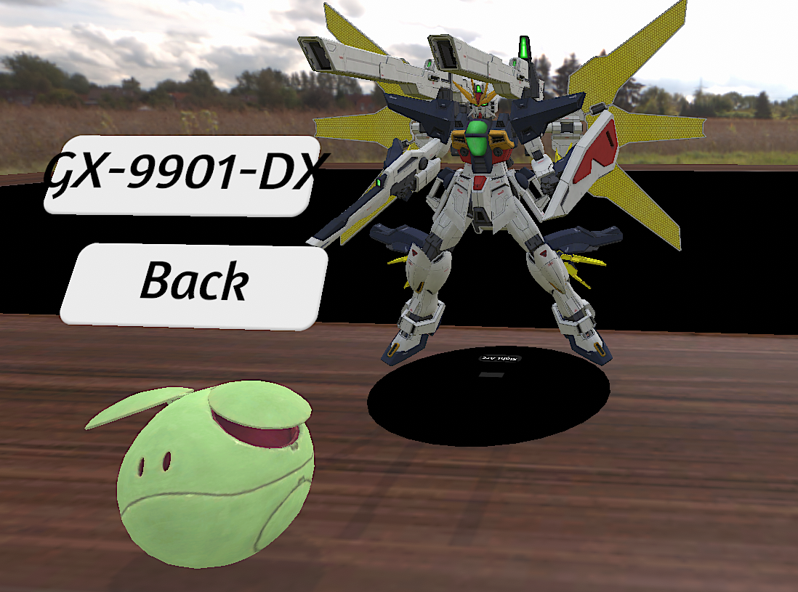

# Adding Assets to the Repository

Now that you've got your fresh and tested AssetBundle ( [detailed here](https://github.com/ScornMandark/gundam-tts-assets/blob/main/contributing/Unity%20Asset%20Bundling.md) ), now it's time to get it into the repository for Haro to create.

## Make sure the faction has a folder
This should be pretty straightforward, since most factions should be set already.  If not, flag it as an issue and I'll get it set up.

## Upload the Bundle
Go to the universe/faction folder, then 'Add File -> Upload File'.  

It will probably prompt you to create a Pull Request, which is what we want.

## Notes for the Pull Request
Please detail the model(s) you're uploading in the notes, with faction info as well.  When I merge the request, I'll update the MS menu to pick those units.

## Final
Thanks for all your help growing this tool into new places!

## Unit Sheets
Make sure your unit sheet is padded with transparency to be square.  For MSSk sheets, for example, I export each PDF page to a .png at 300 dpi (2481 x 3508, A4), then pad the sides with transparent pixels so that each image is 3508 x 3508 (GIMP, ImageMagick, etc).  Then, go to the appropriate faction folder, go to the appropriate game folder, and add it as a file there.  As long as it's named exactly the same as the .unity3d model, no notes are needed.
