# Bundling 3d models into UnityAssetBundles for Tabletop Simulator

If you have your 3d models set up, positioned and scaled properly ( [as detailed here](https://github.com/ScornMandark/gundam-tts-assets/blob/main/contributing/3d%20Model%20Prep%20Instructions.md) ), then we're ready to start the unity import process.

# Things you'll need:
- One or more 3d models set up for import as .obj or .fbx
- [Unity version 2019.1.14f1](https://unity3d.com/unity/whats-new/2019.1.14) (other 2019.1 releases may work with the 3.0 mod release, but this is the one that works for me)
- [Berserk Games TTS project for Unity v3.0](https://github.com/Berserk-Games/Tabletop-Simulator-Modding/releases/tag/v3.0) (there's a newer update that I haven't tried yet, and I'll update this once I do), but this one works)
- More patience...

# Step 1: Installation
First thing is to make sure you've got Unity installed, then you can download the project file for the TTS mod.  The project isn't installed, just put it somewhere you can find it easily.

# Step 2: Opening The Project
Open Unity, and then open the TTS project.  In 'File -> Open Project', go to the folder that the TTS project file unzipped to.  So for me, that might be 'Z:\Gundams\Tabletop-Simulator-Modding\' - not a particular file, just the folder.
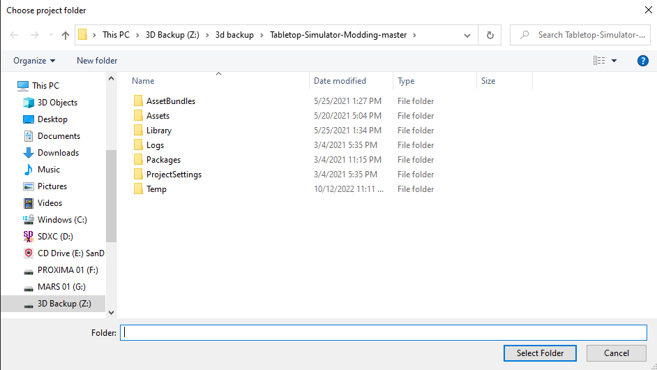

# Step 3: Organizing
Now that the project opened nicely, we need to set up some files.  In the 'Tabletop-Simulator-Modding\Assets' folder, make a new folder called 'Gundam'.  Take the folder with the clump of files, materials, and textures you put together and copy it to the '\Tabletop-Simulator-Modding\Assets\Gundam' folder.  It's really important to keep the files for each unit separate, or it'll become a nightmare really quickly.

# Step 4: Begin
In Unity, in the Heirarchy tab on the left, right click and 'Create Empty'.  Rename the new GameObject however you want, but I like to use the name of the unit.  
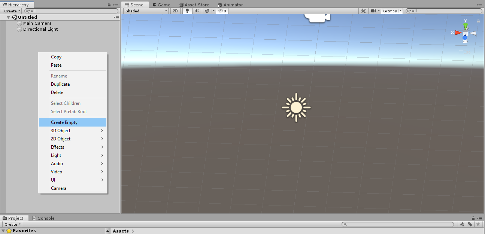
On the right hand side, in the Inspector tab, reset the Position Transforms to X = 0, Y = 0, Z = 0.  Make sure the Rotations are all 0 as well, and the Scales are all 1.

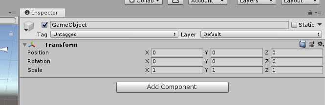

# Step 5: Bring in the models
Now that we've got the structure set up, we can bring in the models.  In the bottom left Project tab, scroll down to the 'Assets\Gundam' folder, then to the unit folder you copied in.  Each model in that folder will have a little thumbnail image with a small arrow pointing to the right.  That arrow expands the file structure to show the mesh, materials, etc.  
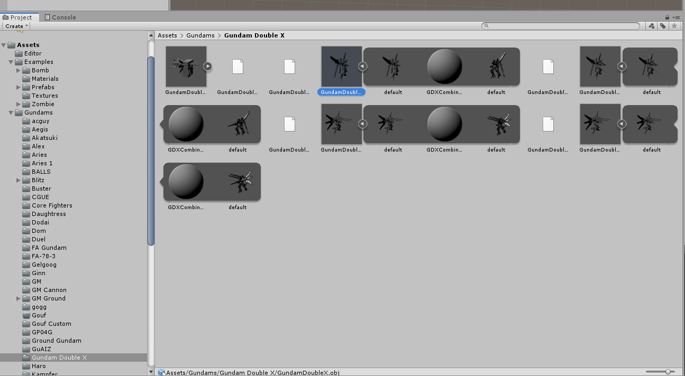
Drag the main thumbnail of each model you want to use onto the GameObject Empty object you created in the last step.  You should see the name of the object pop into the window as a child object, and the mesh itself should show up in the Scene window.  Repeat for all models, but not the collider.

# Step 6: Alignment
Most of the time the objects you bring in aren't at 0,0,0 either, so for each model, select it in the Heirarchy tab, then in the Inspector tab reset the transforms like you did for the empty object.

# Step 7: Collider
Select the parent empty object again and go to the Inspector tab.  Below the Transforms, click 'Add Component', select 'Physics' then 'Mesh Collider'.  
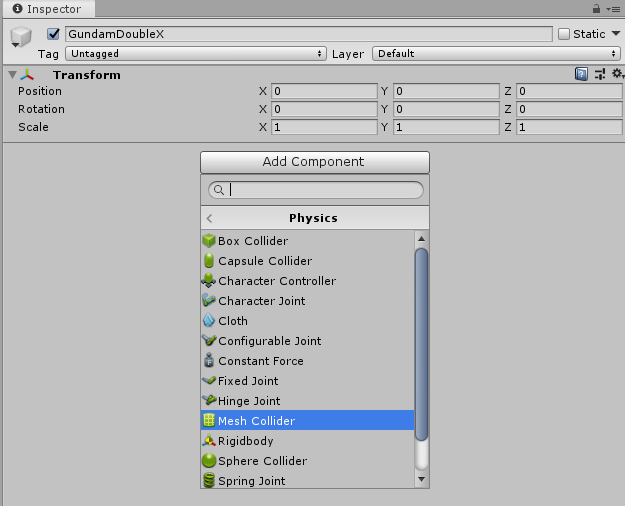
In your project folder, expand the Collider box you made.  The third item in the list should look like a plain grey box with trianglulated sides, called 'default'.  Drag that object to the Mesh Collider tab and drop it in the box for the 'Mesh' (curretly labeled 'None (Mesh)').  (You can check Convex if you want - it speeds up colliding calculations, but it's not really necessary with a box collider.)
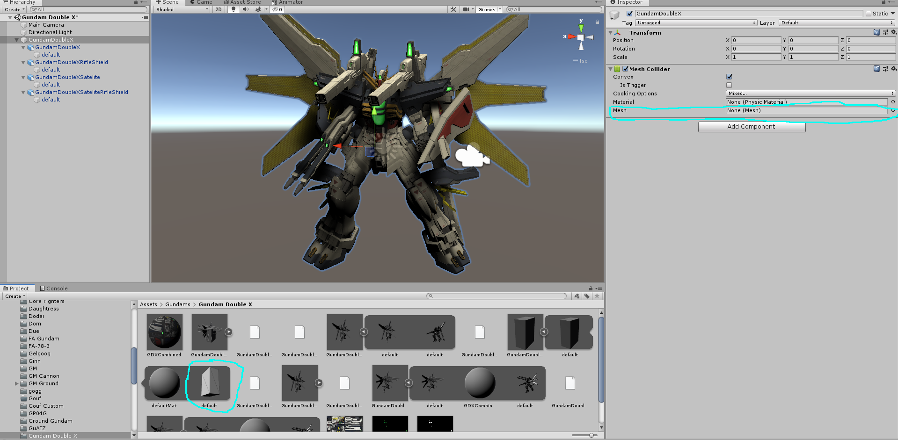

# Step 8: Textures (optional, or if illumination needed)
I often try to remap the objects to use a single material texture - it cuts down the file size pretty decently.  Also, if you want any kind of self illumination, you'll need to do this.  For now, expand one of the models in the Project tab (assuming they all share the same texture map), and right click on the sphere with the texture maps on it.  Select 'Extract from Prefab' and it'll pop out of the model and into the project window.  Then, in the Heirarchy tab, drag it onto the 'default' object below each model.  I'll do a deeper dive on texturing later.
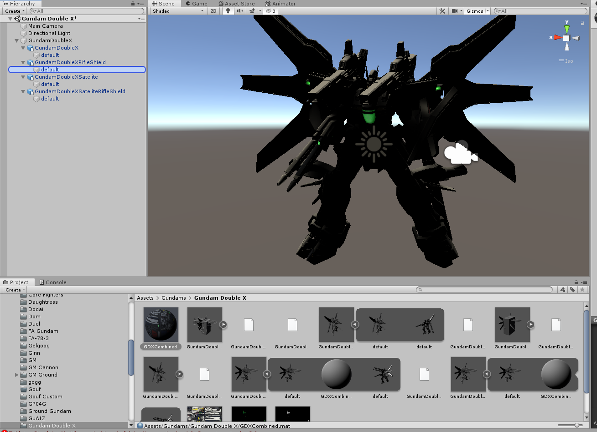

If it looks really dark, you may need to rotate the light in the scene from Y = -30 to Y = +150.
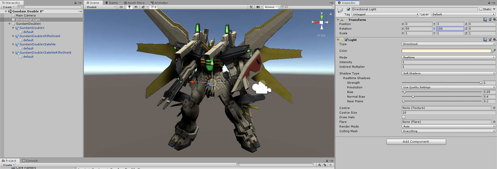

# Step 9: The Options
Here's where we set up the model for use (and multi-pose if you've got it).  Under the 'Mesh Collider' box, click 'Add Component', select 'Scripts' then 'TTS Asset Bundle Effects'.  It will have 2 options - Bundle Effects and Trigger Effects.  
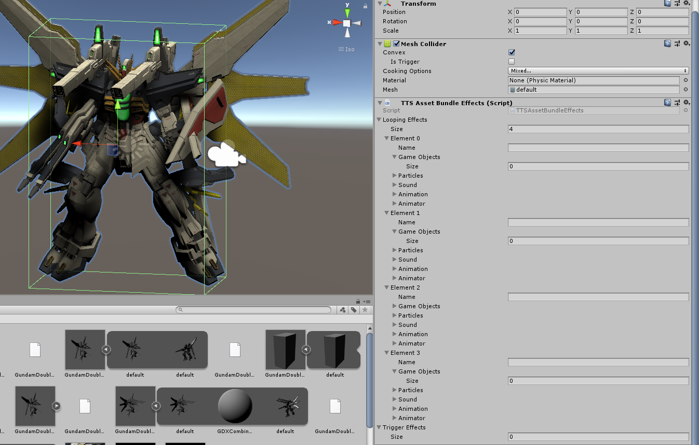
- For now, set 'Trigger EFfects -> Size' to 0.  
- Set 'Bundle Effects -> Size' to however many poses you have and hit Enter.  It can be 1, it can be at least 40, so go to town.  
- - Each 'Element' will need to be given a name.  I tend to name each one after the option displayed ("Beam Rifle", "Machine Gun", "Bazooka", "Chobham + Beam Rifle", etc).  The name will be a tooltip that shows when you hover over each effect option.
- - Each 'Element/Game Options' will need to be set to 1, then press enter.
- - Each time you set a Game Option to 1, a new entry in the tree opens for 'Element #/Game Object' with a box next to Game Object.
- - Drag the 'default' object from each model in the heirarchy to the appropriate Element (you did remember to name them all sensibly, right?)

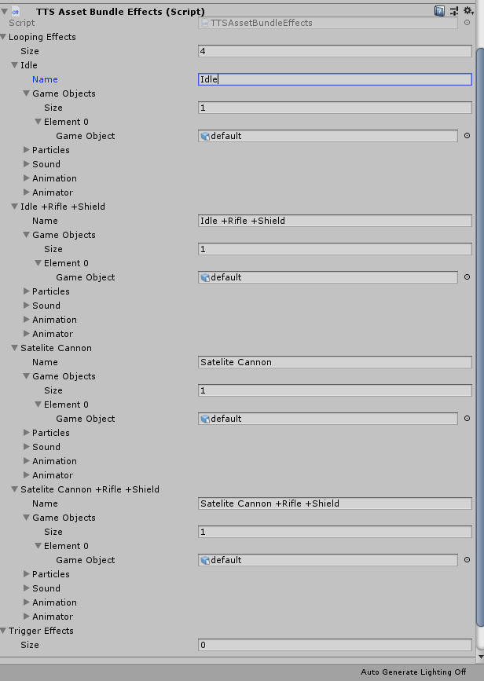

# Step 10: Save
If you haven't already, save the file.  (It'll be a .unity file.)

# Step 11: Asset Bundle
In the Project tab, go to 'Assets\Examples\Prefabs'. Drag the parent GameObject into the Prefabs folder in the Projects tab, and you'll see an preview icon pop up there.  In the Inspector tab to the right, go to the bottom tab "Asset Label".  Open the AssetBundle dropdown under the 3d preview, and select 'New'.  Then, name it in numbers and lower case letters only, no spaces, only hyphens and underscores as special characters.  I tend to use serial numbers when available, like msn-03, gat-x-105, etc.  You can't use brackets or slashes, so I either just remove them or turn them into hyphens.  Then, right click in the Prefabs project window, and select 'Build AssetBundles'.  This can take a while, since you can't selectively build one asset, Unity rebuilds all the AssetBundles in the folder.  As far as I can tell, having them in sub folders doesn't help.  
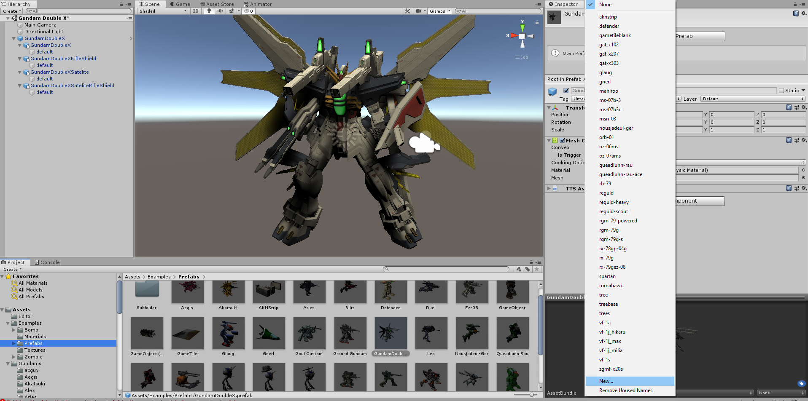

# Step 11: Fresh AssetBundle
In your file structure, the new AssetBundle will be in the 'Tabletop-Simulator-Modding\AssetBundles' folder, named whatever you labeled the asset in the previous step.  Something like 'gx-9901-dx.unity3d'.  
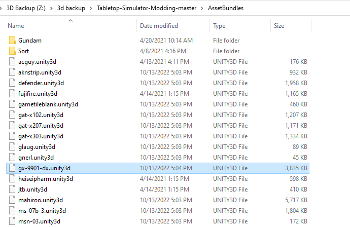

Now it's ready to be imported to TTS!  Go ahead and open TTS, start a game.  Click 'Object', then 'Custom', then 'Asset Bundle'.  Place the cube somewhere, then hit escape to stop placing.  A menu will pop up:
- Main: select the .unity3d file you just made!
- - I usually select local storage for this test, since it's just a test.
- Secondary: usually not needed.
- Type: I usually use figurine, so it stands back up when you pick it up.
- Material:  Doesn't matter too much, I use plastic most often.

Now test it out!  It should just show one pose.  Right click on it, and check the 'Looping Effect' option.  It should show one or more options, with a mouseover tooltip.  Selecting each option should insta switch it to a different mode/equipment.  Hopefully it works the first time!  If not, my usual problem is assigning the wrong model in the Effects modifier.  Trace back to the step where you need to fix it, then repeat the rest of the steps to make sure it works again.
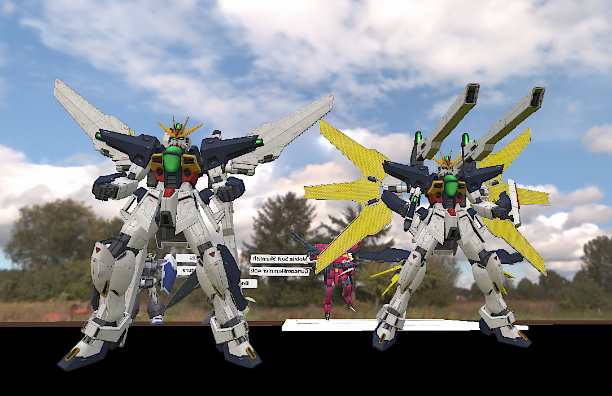

After it's all set, [then it's time to get it into the repository.](https://github.com/ScornMandark/gundam-tts-assets/blob/main/contributing/Adding%20Assets%20to%20the%20Repository.md)

NOTE:  Unity Asset Bundles are intensely powerful tools, with motion triggered animations, looping idle poses, particle effects, and more.  I just scratched the surface here.

